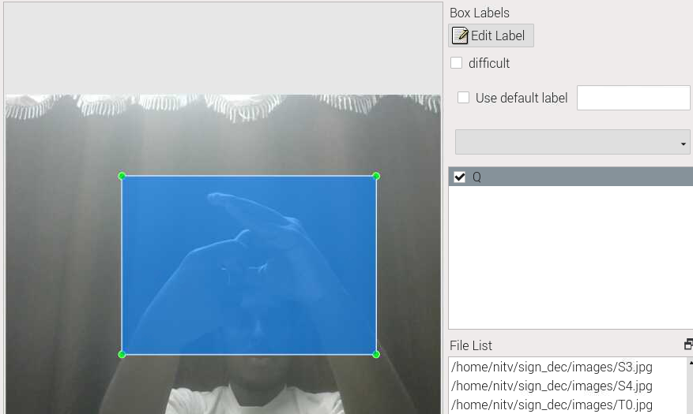
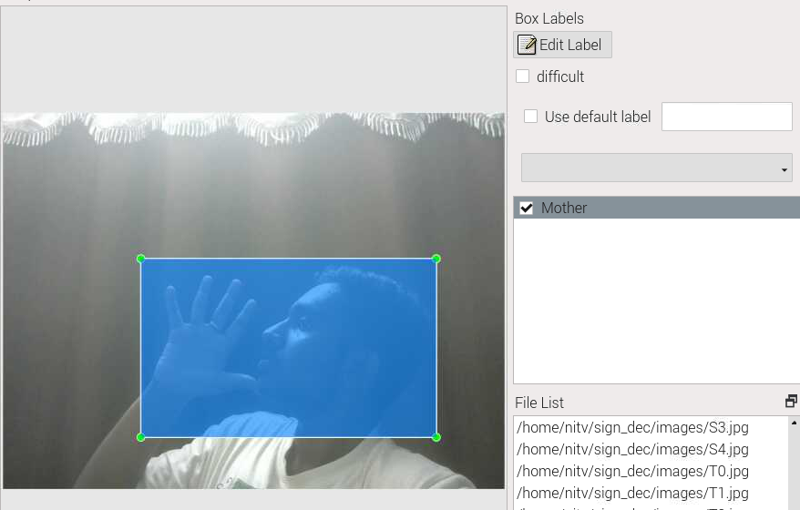
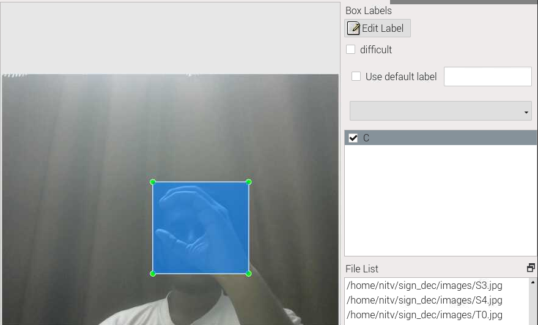
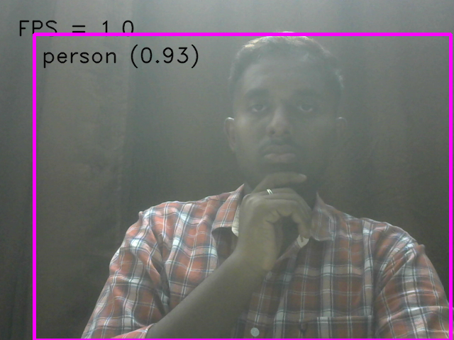
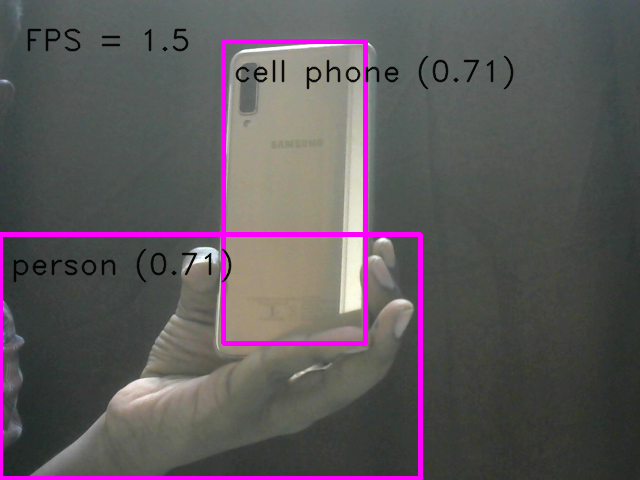
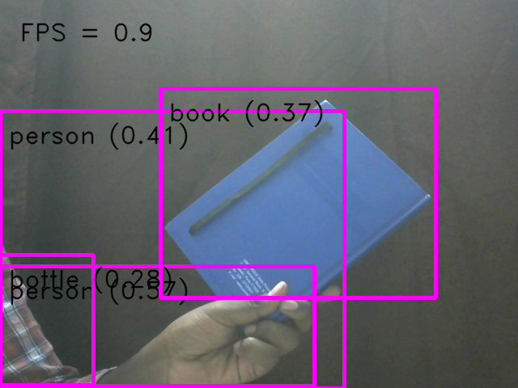
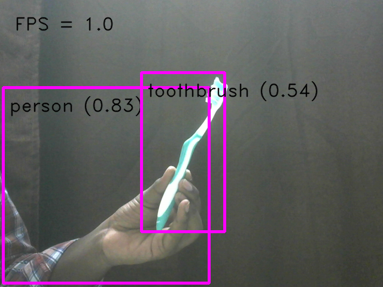
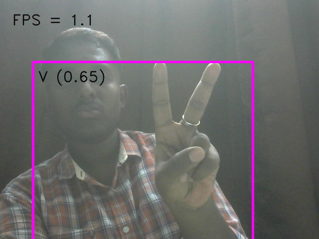
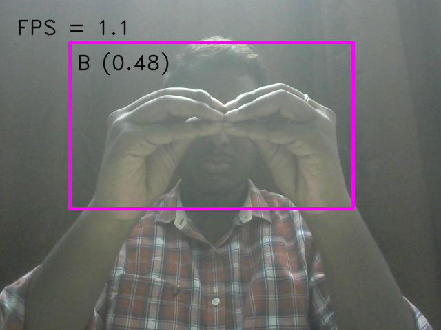

# ARGUS: A Multimodel Assistive System for the Visually and Hearing Impaired

  
  
  
  
  
  
  
  
  
  
  

## Overview
This project proposes an innovative assistive technology that leverages the capabilities of the Internet of Things (IoT) and Artificial Intelligence (AI) to address the unique challenges faced by individuals with visual or hearing impairments. The system integrates advanced AI algorithms for sign language recognition and object detection with IoT devices, creating a comprehensive assistive tool that can benefit both blind and deaf users.

## Features
- Real-time sign language detection
- Object recognition
- Audio descriptions for the visually impaired
- Sign language output for the hearing impaired

## System Components

### Hardware
- Raspberry Pi 3B
- Camera module
- SD card
- Bluetooth and Wi-Fi module
- USB cable
- Ethernet
- HDMI
- Earphone/Speaker
- Power Bank

### Software
- Raspberry Pi OS-ARM 64
- TensorFlow Lite
- Deep Learning Model
- Machine Learning Model
- Object detection
- Sign Language recognition

## Methodology
The system captures audiovisual data through IoT sensors and cameras, processes it using AI algorithms, and translates it into feedback mechanisms. For blind users, it provides auditory descriptions of surroundings. For deaf users, it facilitates communication through sign language.

## Project Description
The project includes hardware setup, AI model development, software integration, testing, and deployment. It aims to be a portable and user-friendly solution that promotes independence and inclusivity.

## Circuit Diagram

## Data and Code
The datasets for training AI models are curated to ensure robust performance. The code includes algorithms for real-time sign language detection and object recognition.

## Experimental Results
The system demonstrates high performance with an accuracy of 99.8% and an inferencing time of 2.22 seconds.

## Conclusion
The ARGUS system enhances communication capabilities and environmental awareness for individuals with visual or hearing impairments, promoting greater independence and social inclusion.

## Authors
- Nitin Prajwal R

